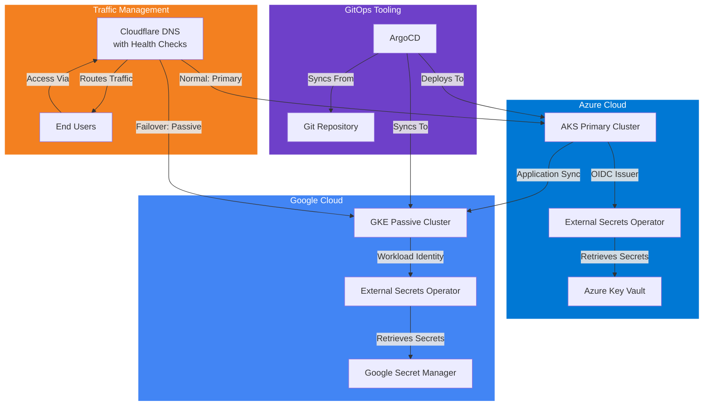

# Multi-Cloud Kubernetes Active-Passive Disaster Recovery Platform

A production-ready active-passive disaster recovery solution spanning Azure Kubernetes Service (AKS) and Google Kubernetes Engine (GKE), with GitOps, external secrets management, and automatic DNS failover.

## Overview

This portfolio project implements a robust multi-cloud disaster recovery strategy for Kubernetes workloads. The solution provides:

- **Primary Active Cluster**: AKS on Azure with GitOps workflow via ArgoCD
- **Passive Standby Cluster**: GKE on Google Cloud Platform ready for failover
- **Automated Secret Management**: External Secrets Operator with cloud-native identity integration
- **Ingress Management**: NGINX Ingress Controller for traffic routing
- **DNS Failover**: Cloudflare-based failover for seamless traffic redirection
- **Infrastructure as Code**: Complete Terraform provisioning for both clouds

## Table of Contents

- [Overview](#overview)
- [Architecture](#architecture)
- [Prerequisites](#prerequisites)
- [Quick Start](#quick-start)
- [Detailed Setup](#detailed-setup)
  - [Azure AKS Configuration](#azure-aks-configuration)
  - [Google GKE Configuration](#google-gke-configuration)
- [Infrastructure Details](#infrastructure-details)
- [Output Values](#output-values)
- [Disaster Recovery Workflow](#disaster-recovery-workflow)
- [Cost Optimization](#cost-optimization)
- [Security Considerations](#security-considerations)
- [Maintenance and Operations](#maintenance-and-operations)
- [Troubleshooting](#troubleshooting)
- [Next Steps](#next-steps)
- [Contributing](#contributing)
- [License](#license)
- [Support](#support)

## Architecture

The following diagram illustrates the multi-cloud active-passive disaster recovery architecture:



*Note: This diagram uses Mermaid.js and will render interactively on GitHub and other platforms that support Mermaid.*

### Key Components

1. **AKS Primary Cluster** (Azure Kubernetes Service)
   - Free-tier control plane with single worker node
   - OIDC issuer enabled for External Secrets Operator
   - Azure CNI networking with custom VNet
   - System-assigned managed identity

2. **GKE Passive Cluster** (Google Kubernetes Engine)
   - Zonal cluster with free-tier control plane
   - Workload Identity enabled for External Secrets
   - Custom VPC with secondary IP ranges
   - Auto-scaling node pool

3. **GitOps Tooling**
   - ArgoCD for declarative application deployment
   - External Secrets Operator for secure credential management
   - NGINX Ingress Controller for external access

4. **Disaster Recovery Components**
   - Cloudflare DNS with health checks and failover
   - Cross-cloud application synchronization
   - Automated failover procedures

## Prerequisites

### For Azure (AKS)
- Azure subscription with contributor access
- Service Principal with appropriate permissions (or Azure CLI authentication)
- Terraform 1.0+ installed

### For Google Cloud (GKE)
- GCP project with billing enabled
- Service account with Kubernetes Engine and Compute Engine permissions
- Terraform 1.0+ installed

### Common Tools
- `kubectl` for Kubernetes cluster management
- `helm` for package management (optional)
- `git` for version control

## Quick Start

### 1. Clone the Repository
```bash
git clone <repository-url>
cd multicloud-k8s-failover
```

### GitHub Actions Deployment

This repo includes a GitHub Actions workflow for Terraform deployment in `.github/workflows/terraform-deploy.yml`.

- Pull requests run `fmt`, `init`, `validate`, and `plan`
- Pushes to `main` run the same checks and then `apply`
- Manual runs support `azure`, `gcp`, or both

Setup details are documented in `docs/github-actions-terraform.md`.

### 2. Set Up Azure AKS Cluster
```bash
cd terraform/azure

# Copy example configuration
cp terraform.tfvars.example terraform.tfvars

# Edit terraform.tfvars with your Azure settings
nano terraform.tfvars

# Initialize and apply
terraform init
terraform plan
terraform apply -auto-approve
```

### 3. Set Up Google GKE Cluster
```bash
cd ../gcp

# Copy example configuration
cp terraform.tfvars.example terraform.tfvars

# Edit terraform.tfvars with your GCP project ID
nano terraform.tfvars

# Initialize and apply
terraform init
terraform plan
terraform apply -auto-approve
```

### 4. Configure Authentication
```bash
# Export Azure credentials (alternative to az login)
export ARM_CLIENT_ID="your-client-id"
export ARM_CLIENT_SECRET="your-client-secret"
export ARM_TENANT_ID="your-tenant-id"
export ARM_SUBSCRIPTION_ID="your-subscription-id"

# Or use Azure CLI
az login

# Export GCP credentials
export GOOGLE_APPLICATION_CREDENTIALS="path/to/service-account-key.json"

# Or use gcloud CLI
gcloud auth application-default login
```

## Detailed Setup

### Bootstrap Prerequisites

If you want Terraform to create the cloud prerequisites needed by the main stacks and GitHub Actions pipeline, use:

- `terraform/init_azure`: creates the Azure service principal, configures GitHub OIDC federation for that identity, assigns subscription access, and creates a Terraform Cloud workspace in local execution mode for the Azure stack
- `terraform/init_gcp`: creates the GCP project, enables required APIs, creates a deployer service account, configures GitHub OIDC federation for that service account, and creates a Terraform Cloud workspace in local execution mode for the GCP stack

These bootstrap stacks are intended to run before `terraform/azure` and `terraform/gcp`.

### Azure AKS Configuration

#### Variables Configuration (`terraform/azure/terraform.tfvars`)
```hcl
location = "eastus"
resource_group_name = "mc-aks-rg"
cluster_name = "mc-aks"
kubernetes_version = "1.29"

node_count = 1
node_vm_size = "Standard_B2s"

vnet_name = "mc-aks-vnet"
subnet_name = "mc-aks-subnet"
vnet_address_space = ["10.0.0.0/16"]
subnet_address_prefix = ["10.0.1.0/24"]

tags = {
  Project     = "multicloud-k8s-failover"
  Environment = "prod"
  ManagedBy   = "terraform"
}
```

#### Remote State Backend (Optional)
Uncomment the Azure Blob Storage backend in `provider.tf` and configure:
```bash
terraform init -backend-config=backend.tfvars
```

### Google GKE Configuration

#### Variables Configuration (`terraform/gcp/terraform.tfvars`)
```hcl
project_id = "your-gcp-project-id"
region = "us-central1"
zone = "us-central1-a"

cluster_name = "mc-gke"
kubernetes_version = "1.29"

node_count = 1
node_machine_type = "e2-small"
node_disk_size_gb = 30

vpc_name = "mc-gke-vpc"
subnet_name = "mc-gke-subnet"
vpc_cidr = "10.1.0.0/16"
subnet_cidr = "10.1.1.0/24"

workload_identity_enabled = true

labels = {
  project     = "multicloud-k8s-failover"
  environment = "prod"
  managed-by  = "terraform"
}
```

#### Remote State Backend (Optional)
Uncomment the GCS backend in `provider.tf` and configure:
```bash
terraform init -backend-config=backend.tfvars
```

## Infrastructure Details

### AKS Cluster (Azure)
- **Control Plane**: Free tier
- **Worker Nodes**: 1 × Standard_B2s (2 vCPU, 4 GB RAM)
- **Networking**: Azure CNI with custom VNet (10.0.0.0/16)
- **Identity**: System-assigned managed identity with OIDC issuer
- **Features**: RBAC, Azure Policy (optional), monitoring (optional)

### GKE Cluster (Google Cloud)
- **Control Plane**: Zonal (free tier)
- **Worker Nodes**: 1 × e2-small (2 vCPU, 2 GB RAM)
- **Networking**: Custom VPC with secondary IP ranges for pods/services
- **Identity**: Workload Identity for service account federation
- **Features**: Auto-repair, auto-upgrade, horizontal pod autoscaling

## Output Values

### Azure AKS Outputs
```bash
cluster_name           # Name of the AKS cluster
cluster_endpoint       # Kubernetes API endpoint (sensitive)
kubeconfig             # Complete kubeconfig (sensitive)
resource_group_name    # Azure resource group name
oidc_issuer_url        # OIDC issuer URL for External Secrets
```

### Google GKE Outputs
```bash
cluster_name           # Name of the GKE cluster
cluster_endpoint       # Kubernetes API endpoint (sensitive)
kubeconfig             # Generated kubeconfig (sensitive)
project_id             # GCP project ID
workload_identity_pool # Workload Identity pool for External Secrets
```

## Disaster Recovery Workflow

### Normal Operation
1. All traffic routes to AKS primary cluster via Cloudflare DNS
2. ArgoCD syncs applications from Git repository to AKS
3. External Secrets Operator retrieves credentials from Azure Key Vault
4. GKE cluster remains synchronized but inactive

### Failover Procedure
1. **Detection**: Cloudflare health checks detect AKS cluster failure
2. **DNS Update**: Cloudflare automatically updates DNS to point to GKE
3. **Secret Switch**: External Secrets Operator switches to Google Secret Manager
4. **Traffic Redirect**: User traffic flows to GKE cluster
5. **Recovery**: Applications continue serving from GKE

### Failback Procedure
1. **Health Verification**: AKS cluster restored and verified
2. **DNS Update**: Cloudflare redirects traffic back to AKS
3. **Secret Revert**: External Secrets Operator reverts to Azure Key Vault
4. **Sync**: ArgoCD ensures applications are synchronized

## Cost Optimization

This implementation minimizes costs through:

### Azure Cost Savings
- Free AKS control plane tier
- Single Standard_B2s worker node (~$0.04/hour)
- No premium add-ons unless required

### Google Cloud Cost Savings
- Free zonal GKE control plane
- Single e2-small worker node (~$0.03/hour)
- Preemptible nodes option available for additional savings

### Estimated Monthly Costs
- **AKS**: ~$30/month (1 × Standard_B2s)
- **GKE**: ~$22/month (1 × e2-small)
- **Total**: ~$52/month for multi-cloud redundancy

## Security Considerations

### Identity and Access Management
- **Azure**: Managed identities with RBAC, OIDC for workload identity
- **Google**: Workload Identity for service account federation
- **No hardcoded credentials** in Terraform configurations

### Network Security
- Custom VNet/VPC with private subnets
- Network policies enabled on both clusters
- Private cluster options available (commented in code)

### Secret Management
- External Secrets Operator for centralized secret management
- Cloud-native secret stores (Azure Key Vault, Google Secret Manager)
- No secrets stored in version control

## Maintenance and Operations

### Updates and Upgrades
- **Kubernetes Version**: Managed through Terraform variables
- **Node Updates**: Auto-upgrade enabled on GKE, manual on AKS
- **Security Patches**: Apply via Terraform or cloud console

### Monitoring
- Azure Monitor integration (optional)
- Google Cloud Operations Suite (optional)
- Custom monitoring dashboard recommendations available

### Backup and Recovery
- **Cluster State**: Terraform state stored in cloud storage
- **Application Data**: Volume snapshots (cloud-specific)
- **Configuration**: Git repository with ArgoCD sync

## Troubleshooting

### Common Issues

#### Terraform Initialization Errors
```bash
# Ensure proper authentication
az login  # For Azure
gcloud auth application-default login  # For Google

# Reinitialize with clean state
terraform init -reconfigure
```

#### Provider Version Conflicts
```bash
# Update provider versions in provider.tf
# Then run:
terraform init -upgrade
```

#### Insufficient Permissions
- Azure: Ensure service principal has Contributor role on subscription
- Google: Ensure service account has Kubernetes Engine Admin and Compute Network Admin roles

#### Cluster Connectivity Issues
```bash
# Test cluster connectivity
kubectl cluster-info
kubectl get nodes

# Regenerate kubeconfig
az aks get-credentials --resource-group <rg> --name <cluster>  # Azure
gcloud container clusters get-credentials <cluster> --zone <zone>  # Google
```

## Next Steps

After infrastructure provisioning:

1. **Install ArgoCD** on both clusters
2. **Configure External Secrets Operator** with cloud identity integration
3. **Set up NGINX Ingress Controller** for external access
4. **Configure Cloudflare DNS** with health checks
5. **Deploy sample applications** to validate the setup
6. **Test failover procedures** to ensure DR readiness

## Contributing

1. Fork the repository
2. Create a feature branch
3. Make changes with proper Terraform formatting
4. Test with `terraform validate` and `terraform plan`
5. Submit a pull request

## License

This project is licensed under the terms of the LICENSE file in the repository.

## Support

For issues, questions, or contributions:
- Open an issue in the GitHub repository
- Review the troubleshooting section above
- Check cloud provider documentation for specific services

---

*This project demonstrates enterprise-grade multi-cloud disaster recovery patterns suitable for production environments while maintaining cost efficiency through careful resource selection.*
