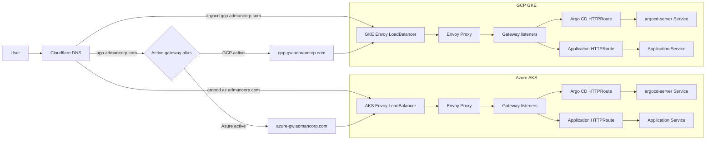
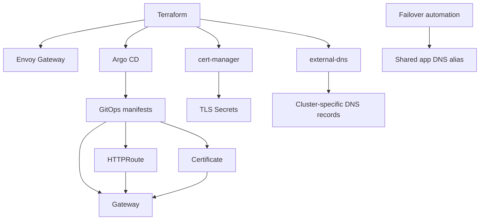

# Envoy Gateway Architecture

## Purpose

This document describes the target architecture for introducing Gateway API
through `Envoy Gateway` across both cloud platforms in this repository:

- Azure AKS
- GCP GKE

The design is built around these constraints:

- one shared Gateway API controller model across both clouds
- Argo CD is exposed through Gateway API
- application traffic is active/passive across clusters
- a given application runs in only one cluster at a time
- the public application hostname stays stable, for example `app.admancorp.com`
- failover automation updates the public DNS alias to point to the active
  cluster-specific gateway record

This document assumes the intended failover hostname is `app.admancorp.com`.

## Design Goals

- Use one Gateway API controller on both AKS and GKE
- Keep the ingress and routing model symmetric across clouds
- Reuse the existing bootstrap components:
  - `external-dns`
  - `cert-manager`
  - Argo CD
- Keep infrastructure bootstrap separate from application routing changes
- Support stable application hostnames during cluster failover
- Keep Argo CD reachable on cluster-specific hostnames as the operational
  exception

## Recommended Controller

`Envoy Gateway` is the recommended Gateway API controller for this repository.

It fits well because it gives you:

- one Gateway API implementation for AKS and GKE
- a simpler north-south traffic layer than a full service mesh
- a cleaner long-term GitOps model than mixing cloud-specific ingress products

## Core Traffic Model

### Application Traffic

For normal applications, use one stable public hostname, for example:

- `app.admancorp.com`

That hostname should point to only one cluster-specific gateway record at a
time.

The active cluster serves the application through its local Envoy Gateway data
plane. The standby cluster may already have the controller and shared Gateway
objects installed, but the public hostname should not resolve to it until the
failover mechanism intentionally switches traffic.

For this repository, the public hostname should not point directly to a load
balancer address. Instead, it should point to a cluster-specific gateway DNS
record such as:

- `azure-gw.admancorp.com`
- `gcp-gw.admancorp.com`

### Argo CD Traffic

Argo CD is the exception and should keep cluster-specific hostnames so both
control planes remain independently reachable:

- `argocd.az.admancorp.com`
- `argocd.gcp.admancorp.com`

This is operationally safer than putting both Argo CD instances behind one
shared failover hostname.

## Ownership Model

### Terraform Bootstrap Layer

Terraform should install these platform components before Argo CD takes over:

- `external-dns`
- `cert-manager`
- `Envoy Gateway`
- Argo CD

Terraform should own the foundational platform resources only:

- namespaces such as `envoy-gateway-system` and `platform-ingress`
- the `Envoy Gateway` Helm release
- Gateway API CRDs, if required by the chart
- the shared `GatewayClass`
- shared TLS bootstrap resources if needed

Terraform should not own the shared `Gateway` or application `HTTPRoute`
objects long term.

### GitOps Layer

Argo CD should manage the routing layer after bootstrap:

- shared `Gateway` objects
- `Certificate` resources for shared listener hostnames and wildcard listener
  certificates
- application `HTTPRoute` resources
- Argo CD `HTTPRoute` resources
- future `ReferenceGrant` or policy resources if they become necessary

This keeps platform bootstrapping in Terraform and keeps traffic policy in the
GitOps workflow.

## Logical Model Per Cluster

For each cluster, use:

- one `GatewayClass`: `admancorp-envoy`
- one shared public `Gateway`, for example `public-gateway`
- one `HTTPRoute` for Argo CD
- one or more application `HTTPRoute` resources

Suggested namespaces:

- `envoy-gateway-system`: Envoy Gateway controller
- `platform-ingress`: shared `Gateway`, listener certificates, and shared routes
- application namespaces: application `Service` and `HTTPRoute` resources
- `argocd`: Argo CD service and Argo CD `HTTPRoute`

## Network Architecture

## Control Plane Architecture

## Active/Passive Failover Model

### Recommendation

Your failover approach is valid and it fits the current project direction well.

The best version of it is:

- keep Envoy Gateway installed in both clusters
- keep the shared `Gateway` shape aligned in both clusters
- keep the application route definition ready in both clusters when practical
- expose the application publicly through one stable hostname such as
  `app.admancorp.com`
- let `external-dns` manage cluster-specific gateway records such as
  `azure-gw.admancorp.com` and `gcp-gw.admancorp.com`
- let failover automation update `app.admancorp.com` to the currently active
  cluster-specific gateway record

### Important Rule

`external-dns` should not manage `app.admancorp.com`.

That record should be managed only by the failover automation, otherwise the two
clusters may fight over the same DNS record.

Instead:

- `external-dns` should manage cluster-specific records such as
  `argocd.az.admancorp.com` and `argocd.gcp.admancorp.com`
- `external-dns` should also manage cluster gateway target records such as
  `azure-gw.admancorp.com` and `gcp-gw.admancorp.com`
- `external-dns` may also manage internal platform records if needed
- the failover script should own the shared public app hostname alias

### Why This Works Well

- one public app hostname for users
- simple mental model for failover
- no cloud-specific gateway dependency
- both clusters can keep the same ingress architecture
- Argo CD remains independently reachable in both clusters during incidents

### Tradeoffs

- DNS failover is not instant; it depends on DNS TTL and client caching
- in-flight sessions may break during failover
- the standby cluster must already have the app and route ready if you want fast
  recovery
- certificates for the app hostname must be valid in whichever cluster may
  become active

### Failover Authority And Fencing

DNS cutover is only one part of failover. The architecture also needs one clear
authority that decides which cluster is active and a fencing model that prevents
both clusters from behaving as active at the same time.

For this repository, the recommended first version is:

- one manual or pipeline-driven failover workflow as the only authority
- one recorded active cluster value such as `azure` or `gcp`
- one explicit promotion flow that verifies the target before DNS is updated
- one fencing step that prevents the old active cluster from continuing as the
  production writer or job runner

The failover authority is responsible for:

- deciding which cluster is currently active
- deciding when promotion is allowed
- deciding when failback is allowed
- updating the shared DNS alias only after the target cluster is confirmed ready

The fencing model is responsible for keeping the passive side passive. Depending
on the application, that may include:

- scaling the old active application down
- disabling old active `HTTPRoute` exposure if needed
- stopping background workers, schedulers, or `CronJob` resources on the old
  active cluster
- disabling write-capable credentials or configuration on the passive cluster

At minimum, the failover workflow should verify the target cluster before
promotion:

- application pods are ready
- the backing `Service` is healthy
- the `HTTPRoute` is accepted and attached to the shared `Gateway`
- TLS material for the public hostname is ready
- an application smoke test passes on the target cluster

Recommended failover order:

1. prepare the standby cluster
2. verify the target application and route are healthy
3. fence the old active cluster
4. record the new active cluster in the failover authority
5. update `app.admancorp.com` to the new cluster-specific gateway alias
6. run public smoke checks against `app.admancorp.com`

If post-cutover smoke checks fail, the workflow should either roll back the DNS
alias to the previous active cluster or stop and require operator review. It
should never leave both clusters behaving as production-active writers.

## DNS Model

Split DNS ownership into two categories.

### Cluster-Specific Records

Managed by `external-dns`:

- `argocd.az.admancorp.com`
- `argocd.gcp.admancorp.com`
- `azure-gw.admancorp.com`
- `gcp-gw.admancorp.com`
- any other cluster-local operational hostname

These records point at the local Envoy `LoadBalancer` service in each cluster.

### Shared Failover Records

Managed by failover automation:

- `app.admancorp.com`
- any other application hostname that should move between clusters

These records should be managed in Cloudflare as aliases to the active
cluster-specific gateway record, for example:

- normal state: `app.admancorp.com -> azure-gw.admancorp.com`
- failover state: `app.admancorp.com -> gcp-gw.admancorp.com`

## TLS Model

`cert-manager` should remain the certificate issuer using the existing
Cloudflare-backed Let's Encrypt DNS-01 `ClusterIssuer`.

Recommended TLS model:

- use wildcard listener certificates at the shared `Gateway` layer
- issue wildcard certificates independently in both clusters through
  `cert-manager`
- keep wildcard certificate ownership in the platform layer, not in application
  charts
- use application `HTTPRoute` hostnames such as `app.admancorp.com` without
  creating a per-application `Certificate` resource
- keep `argocd.az.admancorp.com` and `argocd.gcp.admancorp.com` covered by
  separate certificates or deeper wildcard certificates such as
  `*.az.admancorp.com` and `*.gcp.admancorp.com`

This means the listener TLS secrets are created independently in both clusters
even though the application chart only declares the public hostname in its
`HTTPRoute`.

## Gateway Layout

### Shared Gateway

Use one public `Gateway` per cluster, for example `public-gateway`, with HTTPS
listener definitions for:

- `argocd.az.admancorp.com` on AKS
- `argocd.gcp.admancorp.com` on GKE
- shared application hostnames that may become active on that cluster

The shared `Gateway` should terminate TLS with platform-managed wildcard or
listener certificates. Application charts should not carry per-app TLS secrets
when the shared listener certificate already covers the hostname.

### Route Layout

Use separate `HTTPRoute` resources:

- one route for Argo CD in namespace `argocd`
- one route per application in the application namespace

This keeps ownership close to the service it exposes.

## Argo CD Behind Gateway

Argo CD should move behind Envoy Gateway rather than staying on its own direct
`LoadBalancer` service.

Preferred end state:

- Envoy Gateway is the public entrypoint
- Argo CD server service becomes internal to the cluster
- a dedicated `HTTPRoute` exposes Argo CD through the shared `Gateway`
- Argo CD TLS is terminated by the `Gateway` listener certificate
- if the public ingress path is unavailable, platform engineers can use
  `kubectl port-forward` to access `argocd-server` directly as the break-glass
  path

This gives you one ingress model for platform and apps.

## Deployment Phases

### Phase 1

Bootstrap Envoy Gateway:

- install controller and CRDs
- create `GatewayClass`
- create namespace and shared `Gateway`
- expose Envoy through `LoadBalancer`
- integrate `cert-manager` and `external-dns`

### Phase 2

Move Argo CD behind Gateway API:

- create Argo CD `HTTPRoute`
- stop exposing Argo CD directly through its own public `LoadBalancer`
- keep `argocd.az.admancorp.com` and `argocd.gcp.admancorp.com`

### Phase 3

Move applications behind Gateway API:

- create application `HTTPRoute`
- issue or attach shared wildcard listener certificates in both clusters
- keep `app.admancorp.com` managed by failover automation

### Phase 4

Integrate failover workflow:

- detect application or cluster failure
- promote the standby cluster if the workload is ready there
- update `app.admancorp.com` in Cloudflare to the target gateway alias
- run post-failover smoke checks against the public hostname

## Repository Layout Recommendation

Suggested future structure:

- `docs/envoy-gateway-architecture.md`
- `gitops/platform/base/envoy-gateway/`
- `gitops/platform/azure/dev/envoy-gateway/`
- `gitops/platform/gcp/dev/envoy-gateway/`
- application route manifests near each application's GitOps config

Suggested resource split:

- Terraform:
  - install `Envoy Gateway`
  - install Gateway API CRDs if needed
  - create `GatewayClass`
  - create namespaces
  - bootstrap secrets if required
- GitOps:
  - `Gateway`
  - `Certificate`
  - `HTTPRoute`

If you want the very first implementation to match the current pattern more
closely, Terraform can create bootstrap-only supporting resources, but the
shared `Gateway` should remain GitOps-owned once routing is introduced.

## Operational Recommendations

- Keep the first version simple: one public `Gateway` per cluster
- Do not let `external-dns` manage shared failover hostnames
- Use low but reasonable DNS TTLs for failover hostnames
- Pre-provision wildcard or shared listener certificates in both clusters when
  those clusters may become active
- Keep Argo CD on separate hostnames per cluster
- Prefer alias-based failover records such as
  `app.admancorp.com -> azure-gw.admancorp.com`
- Add smoke checks for:
  - `argocd.az.admancorp.com`
  - `argocd.gcp.admancorp.com`
  - `app.admancorp.com`
- Make the failover script update DNS only after the target app is confirmed
  healthy behind the target Gateway

## Minimum Initial Resource Set

- `Namespace` for `Envoy Gateway`
- `helm_release` for `Envoy Gateway`
- `GatewayClass` named `admancorp-envoy`
- one shared public `Gateway` per cluster
- one Argo CD `HTTPRoute` per cluster
- one TLS `Certificate` for Argo CD listener hostnames or subdomain wildcards
- one wildcard or shared listener `Certificate` for application hostnames per
  cluster
- one `LoadBalancer` service for the Envoy data plane
- cluster-specific DNS records through `external-dns`
- shared app DNS records through failover automation

## Outcome

This architecture gives you a single Gateway API implementation across AKS and
GKE, keeps Argo CD reachable in both clusters, and supports active/passive
application failover through DNS without forcing the two clusters to compete for
the same public record.
